# Capstone Screenshots — Evidence Portfolio
## ShopAWS — Resilient, Scalable, and Recoverable AWS Application

---

## Phase 1 — High Availability

### ShopAWS Live on soliddigital.co.ke (Primary — us-east-1b)
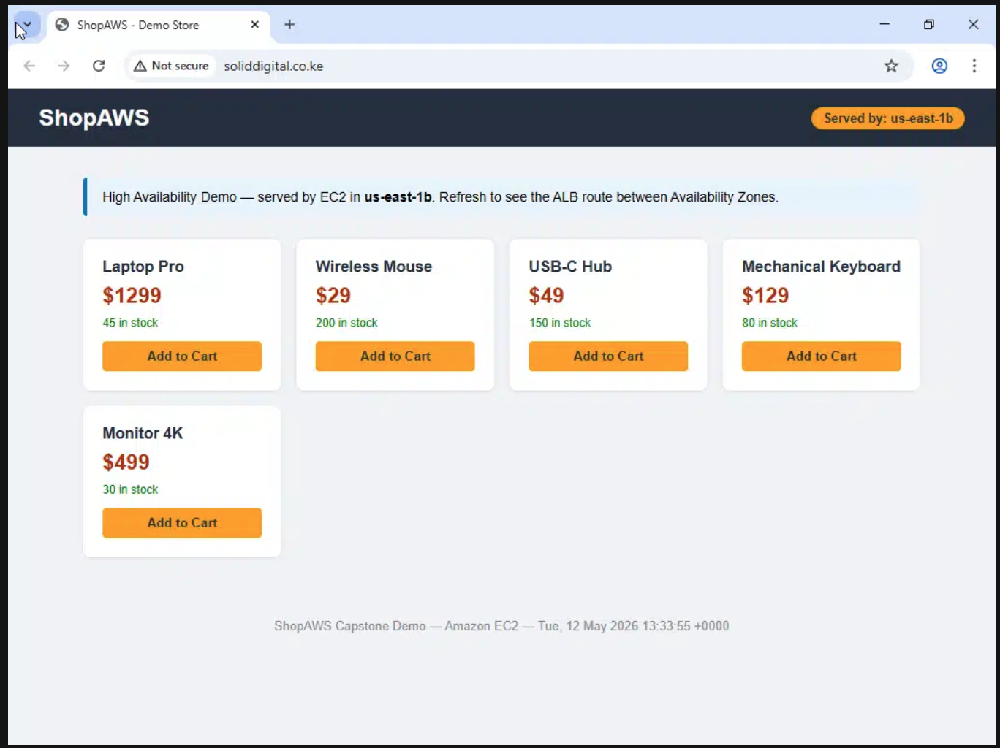

**Evidence:** The ShopAWS store is live at http://soliddigital.co.ke, served by an EC2 instance in **us-east-1b** behind the Application Load Balancer. The orange badge confirms the AZ serving the request.

---

## Phase 2 — Scalability

### Auto Scaling Group Configuration
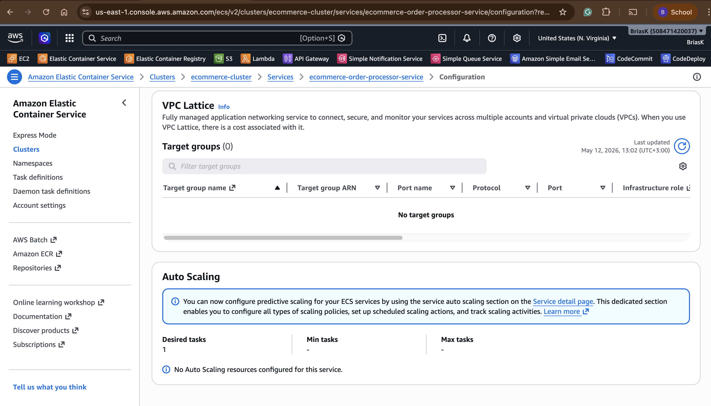

**Evidence:** ECS Fargate service showing Auto Scaling configuration with Desired tasks: 1, confirming the order processor service is running and configured to scale.

---

### SQS Orders Queue
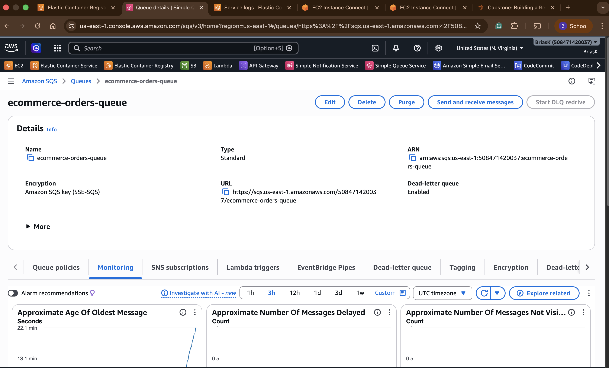

**Evidence:** The `ecommerce-orders-queue` is configured with Dead-letter queue enabled, Standard type, and active monitoring showing message activity. This decouples order processing from the web tier.

---

### SQS Dead Letter Queue
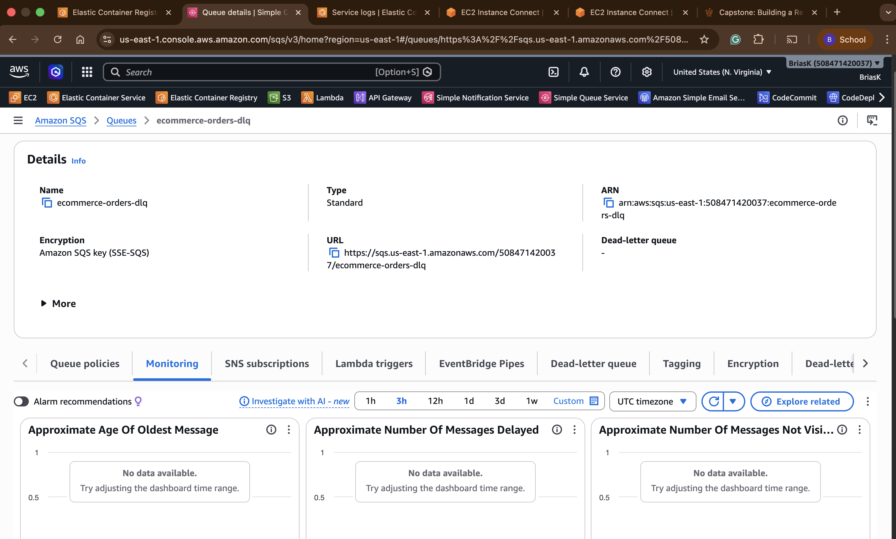

**Evidence:** The `ecommerce-orders-dlq` is configured to capture failed orders after 3 processing attempts, ensuring no orders are silently lost.

---

### ECS Fargate — Order Processing Logs
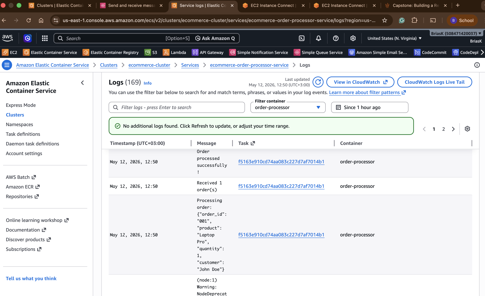

**Evidence:** Fargate logs showing real order processing:
- `Received 1 order(s)`
- `Processing order: {"order_id": "001", "product": "Laptop Pro", "quantity": 1, "customer": "John Doe"}`
- `Order processed successfully!`

This confirms the SQS → Fargate decoupled order processing pipeline is working end-to-end.

---

## Phase 3 — Disaster Recovery

### AWS Backup — RDS and DynamoDB
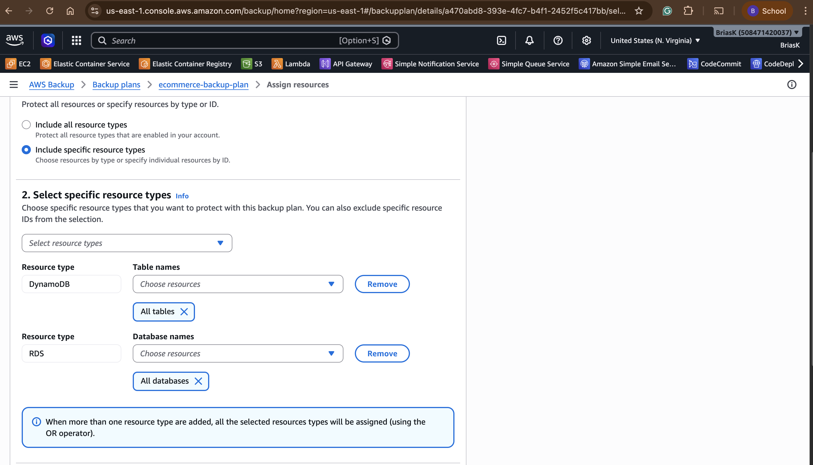

**Evidence:** AWS Backup plan `ecommerce-backup-plan` is configured with:
- **DynamoDB:** All tables backed up
- **RDS:** All databases backed up
- Daily schedule with 7-day retention
- PITR (Point-in-Time Recovery) enabled

---

### Route 53 — DNS Failover Records Configured
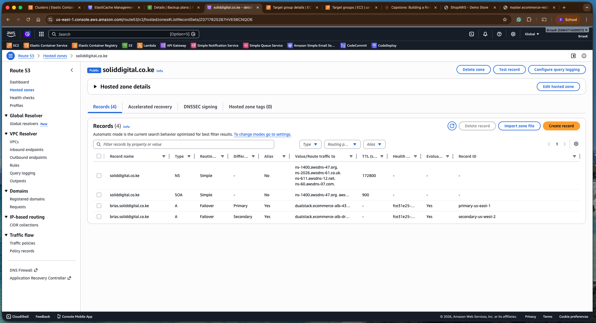

**Evidence:** Route 53 hosted zone for `soliddigital.co.ke` showing:
- **Primary record:** `brias.soliddigital.co.ke` → `dualstack.ecommerce-alb-43...` (us-east-1) — Failover: Primary
- **Secondary record:** `brias.soliddigital.co.ke` → `dualstack.ecommerce-alb-dr...` (us-west-2) — Failover: Secondary
- Health check attached to primary record (ID: fce31e25...)

---

### Route 53 Health Check — Healthy (Primary Region Up)
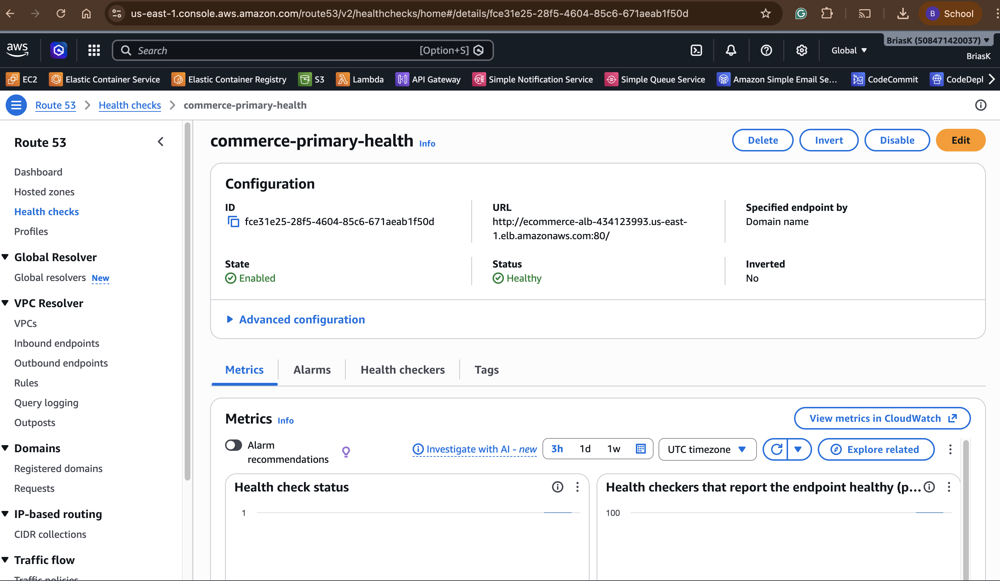

**Evidence:** The `commerce-primary-health` health check showing:
- **Status:** Healthy ✅
- **URL:** http://ecommerce-alb-434123993.us-east-1.elb.amazonaws.com:80/
- **State:** Enabled
- Health checkers reporting 100% healthy

---

### Route 53 Health Check — Unhealthy (DR Failover Triggered)
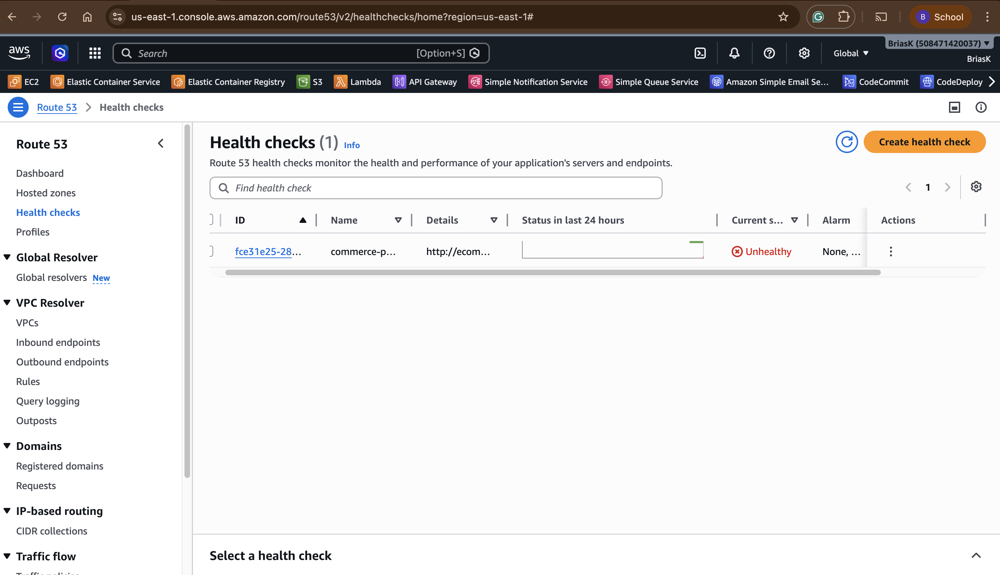

**Evidence:** During the DR simulation (ASG set to 0 instances), the health check shows **Unhealthy** status, triggering automatic Route 53 failover to the secondary region (us-west-2).

---

### DR Mode Active — soliddigital.co.ke Serving from us-west-2
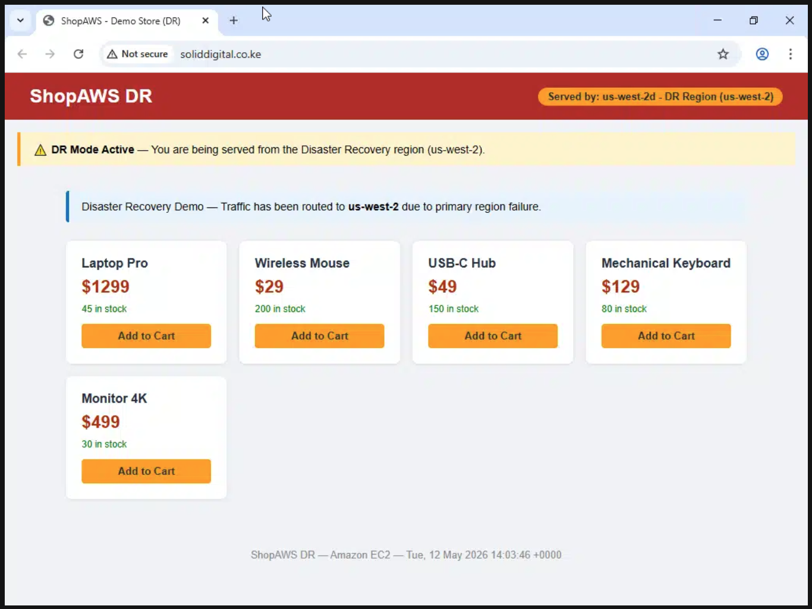

**Evidence:** After Route 53 failover triggers, `soliddigital.co.ke` automatically serves traffic from **us-west-2**:
- Red header: "ShopAWS DR"
- Badge: "Served by: us-west-2d - DR Region (us-west-2)"
- DR banner: "DR Mode Active — You are being served from the Disaster Recovery region (us-west-2)"
- URL still shows `soliddigital.co.ke` — fully transparent to users

---

### DR ALB — us-west-2 Load Balancer Working
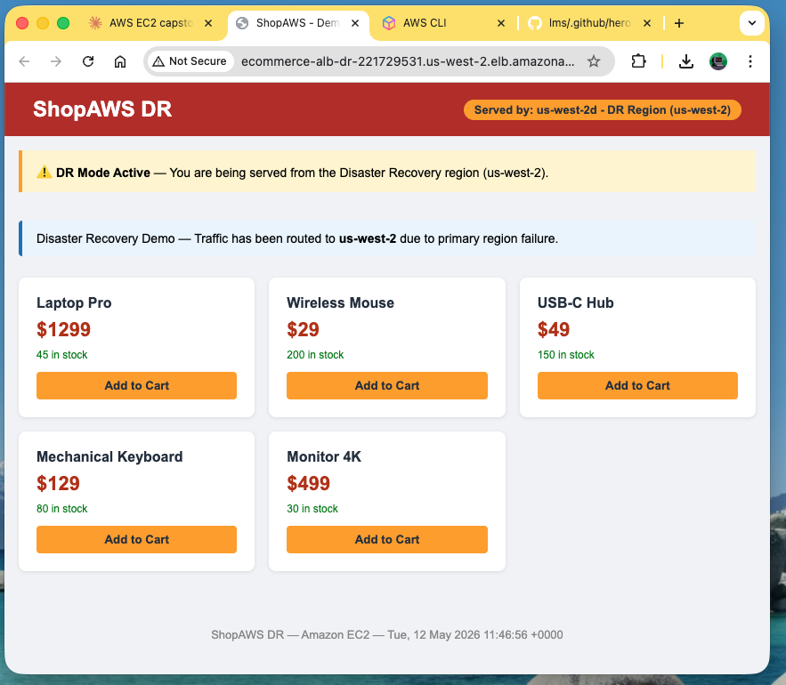

**Evidence:** The DR Application Load Balancer in us-west-2 serving the ShopAWS DR site directly, confirming the DR infrastructure is fully operational.

---

## Observability

### CloudWatch Dashboard — ecommerce-dashboard
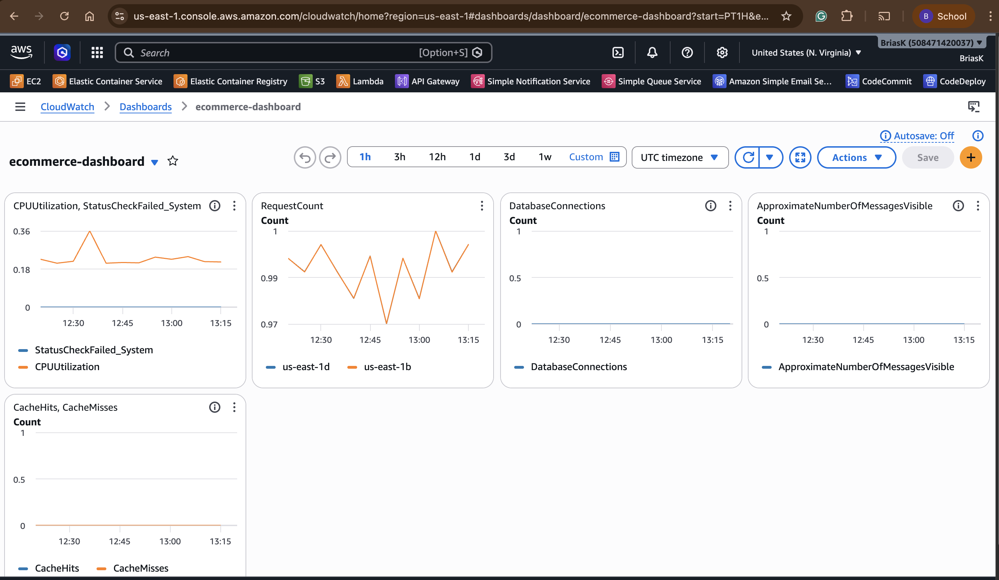

**Evidence:** The `ecommerce-dashboard` showing 5 monitoring widgets:
- **CPUUtilization + StatusCheckFailed_System** — EC2/ASG health
- **RequestCount** — ALB traffic split between us-east-1b and us-east-1d (both AZs serving traffic)
- **DatabaseConnections** — RDS connection monitoring
- **ApproximateNumberOfMessagesVisible** — SQS queue depth
- **CacheHits / CacheMisses** — ElastiCache Redis performance

---

### CloudWatch Alarms — All Configured and OK
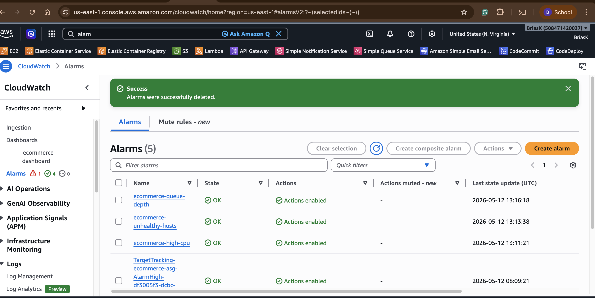

**Evidence:** 5 CloudWatch alarms configured and showing OK status:
- `ecommerce-queue-depth` — SQS queue depth > 100 ✅ OK
- `ecommerce-unhealthy-hosts` — ALB unhealthy hosts > 0 ✅ OK
- `ecommerce-high-cpu` — EC2 CPU > 80% ✅ OK
- `TargetTracking-ecommerce-asg-AlarmHigh` — ASG scaling alarm ✅ OK

All alarms have **Actions enabled** via SNS topic `ecommerce-alerts`.

---

## Summary of Evidence

| Component | Screenshot | Status |
|---|---|---|
| ShopAWS live on soliddigital.co.ke | Website_on_soliddigital_co_ke.png | ✅ |
| Auto Scaling Group configuration | auto_scaling_configuration.png | ✅ |
| SQS Orders Queue | SQS_Queue_Overview.png | ✅ |
| SQS Dead Letter Queue | SQS_Dead_Letter_Queue.png | ✅ |
| Fargate order processing logs | ECS_LOGS_ORDER_PROCESSING.png | ✅ |
| AWS Backup (RDS + DynamoDB) | Backup_plan_for_Dynamo_and_RDS.png | ✅ |
| Route 53 failover records | DNS_Records_configured.png | ✅ |
| Health check — Healthy | Route_53_showing_healthy.png | ✅ |
| Health check — Unhealthy (DR triggered) | health-check-unhealthy.png | ✅ |
| DR mode active on soliddigital.co.ke | dr-mode.png | ✅ |
| DR ALB working in us-west-2 | US-West-DR-Load_Balancer.png | ✅ |
| CloudWatch dashboard | Cloudwatch_Dashboard.png | ✅ |
| CloudWatch alarms | Alarm_created.png | ✅ |
